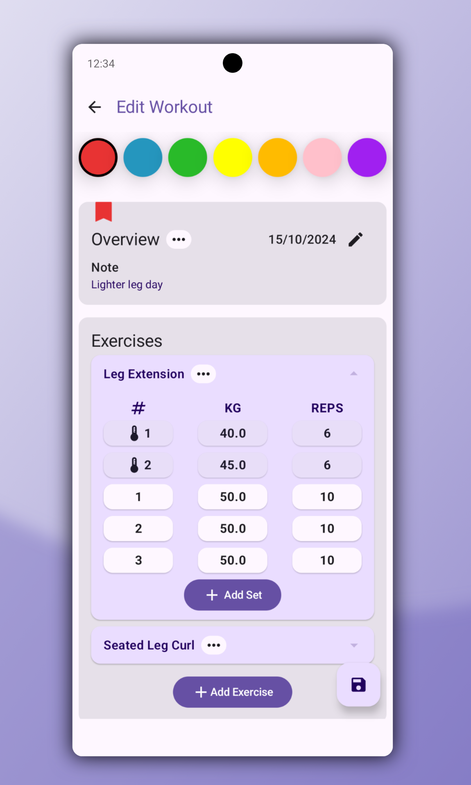
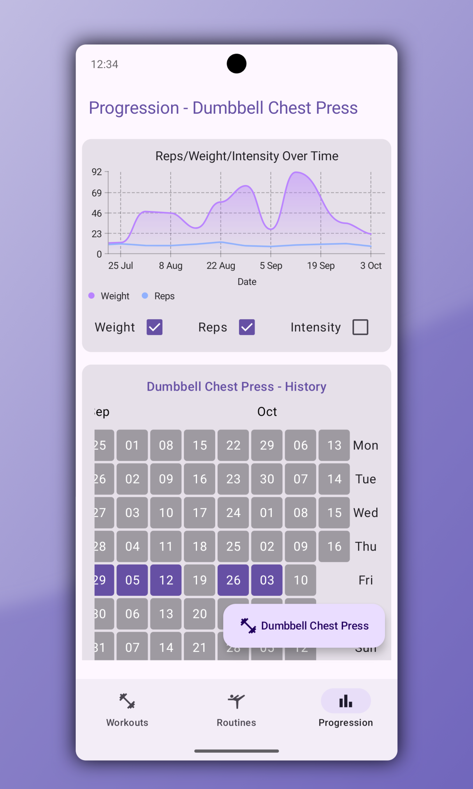
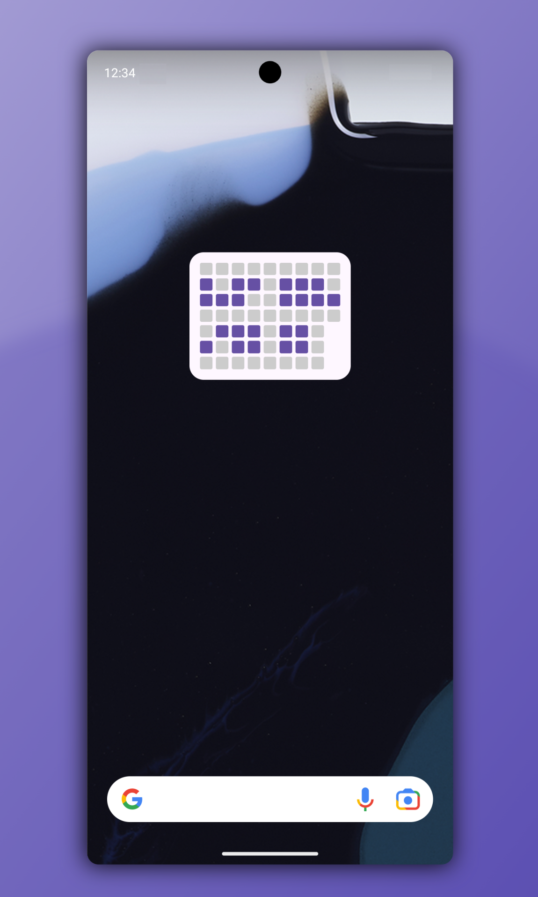

  

 

  A workout tracking app for Android built with Kotlin & Jetpack Compose

## Features
- 🏷️ Organize your workouts with colored labels
- 🖼️ A GitHub inspired home screen calendar widget
- 📦 Local storage with Room, no collection of data
- 🎨 Dynamic Theming using Material You
- 🏗️ Built with clean architecture in mind

## Background
UpLift is an app I made for tracking my my exercise growth and development, built with clean architecture in mind.

## Screenshots

